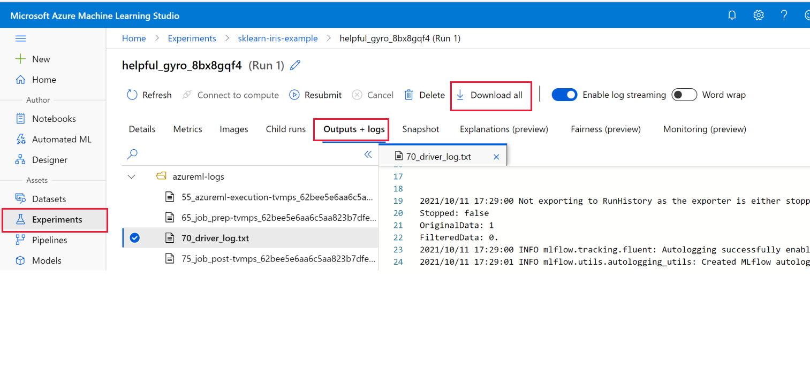

# Quickstart: Deploy the model (private preview)

Now that you've trained a model, it's time to deploy it for use in predicting scores for new data.

In this quickstart, you'll use the job creation wizard to deploy a model.  You'll learn how to:

* Register a model
* Deploy the model to a managed inference
* Try out the model with some new sample data

## Prerequisites

Complete either one of these quickstarts:

* [Quickstart: Try it out with a sample model (preview)](quickstart-train-model-sample.md)
* [Quickstart: Train your own model with the job creation wizard (preview)](quickstart-train-model.md)
 
## Download model

The deploy wizard helps you deploy a model you've trained, either in Azure Machine Learning, or elsewhere.  In this quickstart, you'll use the model that you trained in one of the prerequisite quickstarts. 

1. Sign in to [Azure Machine Learning studio](https://ml.azure.com). Use the information provided to you to activate the private preview.
1. Select **Go to workspace** for your workspace. If you don't have one, select **Create workspace** and follow the steps to create one.  Once created, select **Go to workspace**.
1. On the left, select **Experiments**.
1. Select the experiment that contains the model (for example, sklearn-iris-example for the model created from [Quickstart: Try it out with a sample model (preview)](quickstart-train-model-sample.md)).
1. Select the link on the display name for the run.
1. Select the **Output + logs** tab.
1. Select **Download all** in the tools above the tabs.

    

1. Locate the downloaded folder or zipped file. If it downloads as a zipped file, extract all contents into a folder to use in the next step.

## Deploy the model

1. Select **Home** to return to the studio homepage
1. Select **Deploy your model**.

    

Fill out the **Create deployment (preview)** wizard as shown in the following sections.

### Endpoint

1. For **Endpoint name**, enter **iris-endpoint**.
1. Leave the rest of this page with default values.
1. Select **Next**.

### Model

1. Select **+ Register model**.
1. Name the model **iris-classification**.
1. For the **Model framework**, select **scikitlearn**.
1. For the **Framework version** enter **0.24.1**.
1. for the **Model file or folder**, select **Upload folder**.
1. Select **Browse**, and select the *model* folder inside your downloaded output folder.
1. Select **Upload** on the prompt to confirm the upload of four files.
1. Select **Register**.
1. Select the model **iris-classification** in the list of registered models.
1. Select **Next**.

### Deployment

1. Leave all the defaults on this page.
1. Select **Next**.

### Environment

Waiting to see latest build for rest of info.