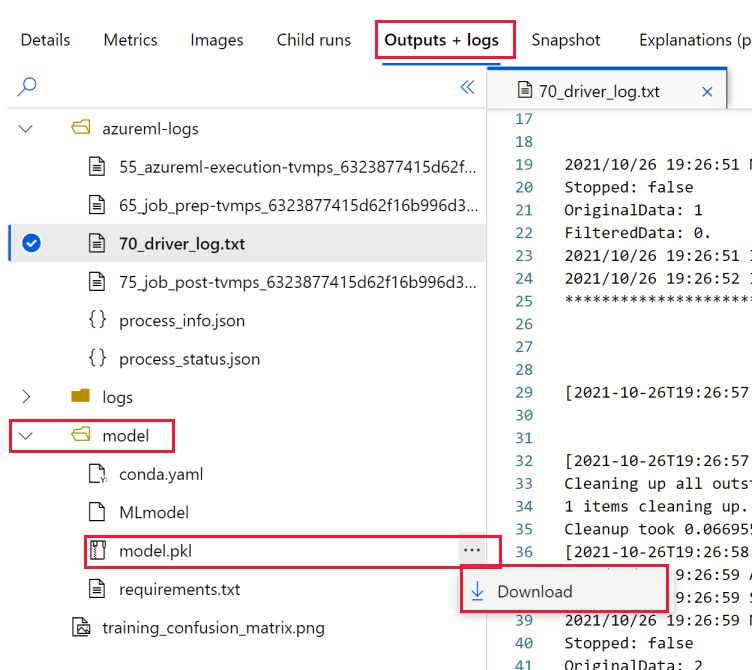
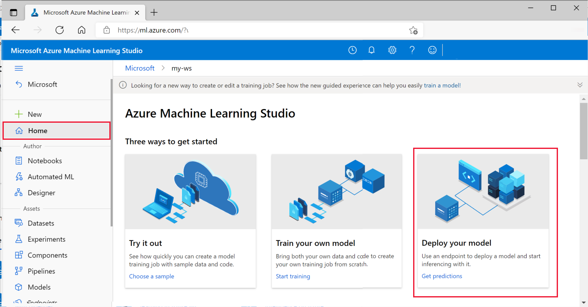
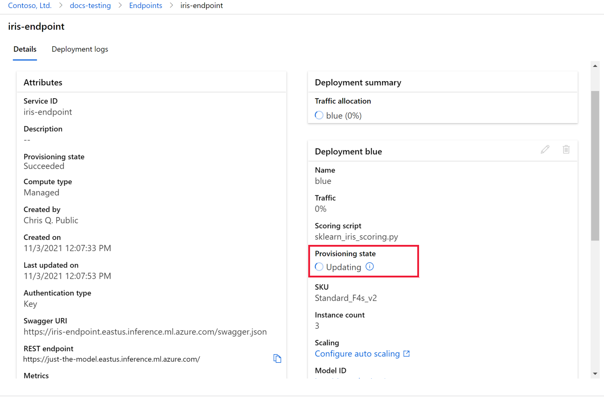
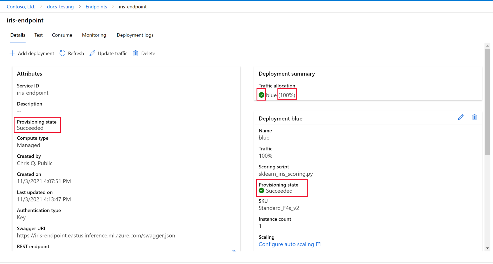
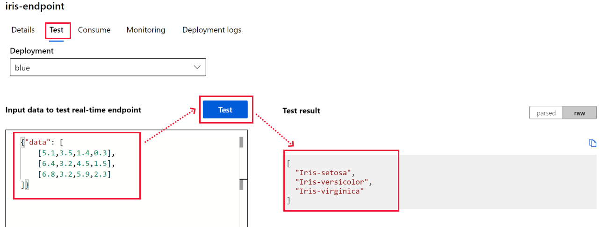
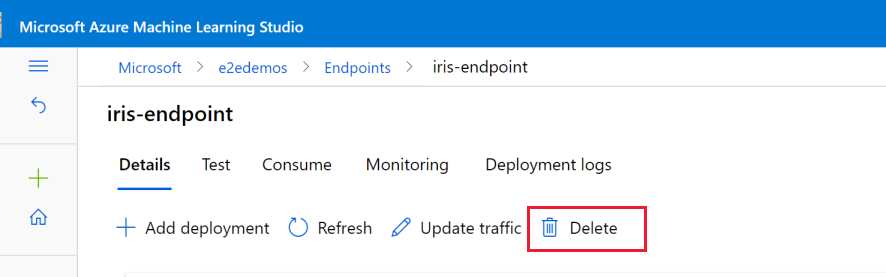

# Quickstart: Deploy the model (private preview)

Now that you've trained a model, it's time to deploy it for use in predicting scores for new data.

In this quickstart, you'll use the job creation wizard to deploy a model.  You'll learn how to:

* Register a model
* Deploy the model to a managed inference
* Try out the model with some new sample data

## Prerequisites

Complete either one of these quickstarts:

* [Quickstart: Try it out with a sample model (preview)](quickstart-train-model-sample.md)
* [Quickstart: Train your own model with the job creation wizard (preview)](quickstart-train-model.md)
 
## Download model

The deploy wizard helps you deploy a model you've trained, either in Azure Machine Learning, or elsewhere.  In this quickstart, you'll use the model that you trained in one of the prerequisite quickstarts. 

1. Sign in to [Azure Machine Learning studio](https://ml.azure.com). Use the information provided to you to activate the private preview.
1. Select **Go to workspace** for your workspace. If you don't have one, select **Create workspace** and follow the steps to create one.  Once created, select **Go to workspace**.
1. On the left, select **Experiments**.
1. Select the experiment that contains the model (for example, sklearn-iris-example for the model created from [Quickstart: Try it out with a sample model (preview)](quickstart-train-model-sample.md)).
1. Select the link on the display name for the run.
1. Select the **Output + logs** tab.
1. Open the **model** folder.
1. Select **Download** for the **model.pkl** file.

    

    > [!NOTE]
    > Your log files may look different from this screenshot.  But you'll still have a **model** folder.

1. Make sure the name of the file is **model.pkl**.  If it contains a version number (because your download directory already has that filename), move it elsewhere and change its name to **model.pkl**.  That's the name you'll be using in the scoring script in the next section.

## Create a scoring script

You use a scoring script to run the deployed model.  For the iris classification model, copy the code below and save the file **sklearn-iris-scoring.py**.  You'll upload this file in the steps below.

```python
import os
import logging
import json
import numpy
import joblib


def init():
    """
    This function is called when the container is initialized/started, typically after create/update of the deployment.
    You can write the logic here to perform init operations like caching the model in memory
    """
    global model
    # AZUREML_MODEL_DIR is an environment variable created during deployment.
    # It is the path to the model folder (./azureml-models/$MODEL_NAME/$VERSION)
    model_path = os.path.join(
        os.getenv("AZUREML_MODEL_DIR"), "model.pkl"
    )
    # deserialize the model file back into a sklearn model
    model = joblib.load(model_path)
    logging.info("Init complete")


def run(raw_data):
    """
    This function is called for every invocation of the endpoint to perform the actual scoring/prediction.
    In the example we extract the data from the json input and call the scikit-learn model's predict()
    method and return the result back
    """
    logging.info("Request received")
    data = json.loads(raw_data)["data"]
    data = numpy.array(data)
    result = model.predict(data)
    logging.info("Request processed")
    return result.tolist()

```

## Deploy the model

1. In studio, select **Home** to return to the studio homepage
1. Select **Deploy your model**.

    

Fill out the **Create deployment (preview)** wizard as shown in the following sections.

### Endpoint

1. For **Endpoint name**, enter **iris-endpoint**.
1. Leave the rest of this page with default values.
1. Select **Next**.

### Model

1. Select **+ Register model**.
1. Name the model **iris-classification**.
1. For the **Model framework**, select **scikitlearn**.
1. For the **Framework version** enter **0.24.1**.
1. for the **Model file or folder**, leave it as **Upload file**.
1. Select **Browse**, and select the *model.pkl* file you downloaded above.
1. Select **Register**.
1. Select the model **iris-classification** in the list of registered models.  (If the list doesn't appear, try refreshing your browser page.)
1. Select **Next**.

### Deployment

1. Leave all the defaults on this page.
1. Select **Next**.

### Environment

1. Browse to find and upload the scoring script you created above.
1. Scroll down if necessary to select the **scikit-learn** environment.
1. Select **Next**.

### Compute 

1. Set the **Instance count** to 1.
1. Select **Next**.

### Traffic

1. Leave all the defaults on this page.
1. Select **Next**.

### Review

Select **Create** to create the scoring endpoint.

## Deployment details

Once the endpoint is created, you'll see the **Details** tab for the endpoint.  Deployment of the model is still taking place when you first see this page.  You'll see information about the model deployment on the left.

 

The complete deployment may take 5-10 minutes.  The model is deployed and ready to use when:

* Provisioning state for the endpoint is **Succeeded**
* Traffic allocation for the deployment is **blue(100%)**
* Provisioning state for the deployment is **Succeeded**

 

> [!IMPORTANT]
> Make sure the traffic allocation is 100%.  When the green check mark first appears, it will be at 0%.  


## Test the deployment

Once the model deployment is ready, select the **Test** tab to test the model.  

The iris model expects values of sepal_length, sepal_width, petal_length and petal_width. Based on this input, it will classify the species as either Iris-setosa, Iris-virginica, or Iris-versicolor.

Test by copying and pasting into **Input data to test real-time endpoint**:

```json
{"data": [
    [5.1,3.5,1.4,0.3],
    [6.4,3.2,4.5,1.5],
    [6.8,3.2,5.9,2.3]
]}
```

After you paste the data, select **Test** to view the test results.  You'll see the predicted values for each sample input.

 

## Consume

Use the information in the **Consume** tab to call this model from you application.

## Clean up resources

Since the deployed model must always be available, the VM is always running. Once you're finished using the deployed model, delete the endpoint to keep from being charged for this VM.



