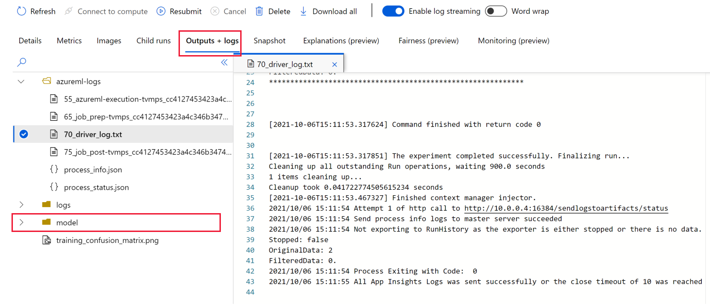

# Quickstart: Try it out with a sample model (preview)

Get started with Azure Machine Learning by training a sample model. 

In this quickstart, you'll train a sample model and see how Azure Machine Learning helps you keep track of your training runs.  

## Prerequisites

* An Azure account with an active subscription. [Create an account for free](https://azure.microsoft.com/free/?WT.mc_id=A261C142F).

## Try it out

 

1. Sign in to [Azure Machine Learning studio](https://ml.azure.com). Use the information provided to you to activate the private preview.
1. Select **Go to workspace** for your workspace. If you don't have one, select **Create workspace** and follow the steps to create one.  Once created, select **Go to workspace**.
1. To train your first model, select **Try it out**.
1. Select  **Classification - Scikit-learn - Iris dataset**.  This example will build a model to classify different species of iris flowers by using the Iris dataset.
1. Select **Show job details** to see more about the job that will run.  Scroll down to view the data, along with a preview of the first five rows of data.  
1. Select **Run sample job** to run this job on the default compute cluster.

     

> [!TIP]
> If you didn't already have a compute cluster, one named **AMLSampleCluster** will be created and added to your workspace.  You can continue to use it for other jobs.  It will scale down to 0 nodes, which means it doesn't cost anything when it's not in use.

## View results

Once you submit the job, you'll see the **Details** page of the job run.  This is where you view and manage your runs.  You can re-submit a previous job or delete a run's output from here, using the tools at the top of the page.

> [!TIP]
> To return to this page later, from [studio](https://ml.azure.com)
> * Select **Experiments** on the left, 
> * Select the experiment name **sklearn-iris-example**
> * Select the display name for the run.

After a minute or so, you'll see a notification about the job.  The notification appears briefly in the upper right corner.  Also a number is added to the bell icon in the upper right. Click the bell to view and dismiss notifications.

If the **Status** on the page doesn't update, select **Refresh**.  You may see a few more notifications: when the job is queued, when the run starts, and when it completes.  Each time, after the notification, you may have to use **Refresh** to view the status on the page.

## Snapshot

While you're waiting for the run to complete, select **Snapshot** to view the files used in the run.  Select **main.py** to view the script. In this example, `mlflow.autolog()` was specified before the training code. Since the scikit-learn framework is supported by MLflow for autologging, this single call in the script will produced the metrics, images, and model files seen above.

 

## Details

If you wish, return to the details page while you wait for the notification that the run has completed.  Or use **Refresh** occasionally on the details page too view the current status.

The amount of time to complete the job will vary, but should take around five or six minutes, if you're using the compute resource for the first time. This includes time to create the compute cluster, spin up a node, and run the job.

## Metrics

Once the job completes, select **Metrics** to view metrics that were logged in the training script.  If no output appears, select  **Refresh** in the toolbar above the **Details** tab.  

In this example, you see metrics produced by using `mlflow` in the training script.  For more information about these results and those that follow, see [mlflow.sklearn](https://mlflow.org/docs/latest/python_api/mlflow.sklearn.html).

## Images

Select  **Images** to view any images that were created in the training script.  In this example, you'll see a confusion matrix.

If you selected a different sample, you might see different images here.

## Output + logs

Select **Output + logs** to view all output from the training script, as well as logs from the run. The logs can be useful if you have problems running the script.  You can view logs while the job is running.

Once the job is complete, the *model* folder contains all model files that are saved in the training script.

 

> [!NOTE]
> Your log files may look different from this screenshot.  But you'll still have a **model** folder.

## Next steps

* See [Quickstart: Deploy the model (preview)](quickstart-deploy-model.md) to deploy the model you just trained.
