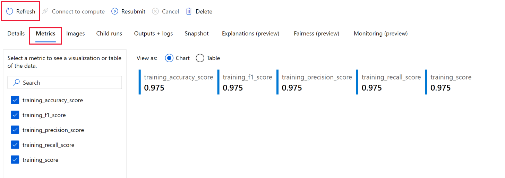

# Quickstart: Train your own model with the job creation wizard (preview)

Bring your own data and code to create your training job in Azure Machine Learning. Completing this quickstart incurs a small cost of approximately 10 USD cents in your Azure account.

In this quickstart, you'll use the job creation wizard to submit a training job.  You'll learn how to:

* Create an Azure Machine Learning dataset
* Upload a training script that uses the dataset
* Run the training script 
* Review the results in Azure Machine Learning studio 

## Prerequisites

* An Azure account with an active subscription. [Create an account for free](https://azure.microsoft.com/free/?WT.mc_id=A261C142F).
* An Azure Machine Learning workspace.  If you don't have one, [create one now](https://docs.microsoft.com/azure/machine-learning/how-to-manage-workspace?tabs=python).

## Create a training script

In this quickstart, you'll build a model to classify different species of iris flowers by using the Iris dataset.  This is the same model built in the [Quickstart: Train a sample model](quickstart-train-sample.md).  This time you'll supply both the code and the data.

In the training script, `mlflow.autolog()` is specified prior to the training code. Since MLflow supports the scikit-learn framework, this single call in the script will produced the metrics, images, and model files you'll see once the run completes.

> [!TIP]
>  If your frameworks supports it, [MLflow](https://mlflow.org/) is the easiest way to produce output and logs from your training script.

Copy the code belo w and paste it into a file named *main.py*.  This file is your training script, which you'll use in the steps below.

```python {highlight=13-14}
# imports
import os
import mlflow
import argparse

import pandas as pd
import matplotlib.pyplot as plt

from sklearn.svm import SVC
from sklearn.model_selection import train_test_split

# define functions
def main(args):
    # enable auto logging
    mlflow.autolog()

    # setup parameters
    params = {
        "C": args.C,
        "kernel": args.kernel,
        "degree": args.degree,
        "gamma": args.gamma,
        "coef0": args.coef0,
        "shrinking": args.shrinking,
        "probability": args.probability,
        "tol": args.tol,
        "cache_size": args.cache_size,
        "class_weight": args.class_weight,
        "verbose": args.verbose,
        "max_iter": args.max_iter,
        "decision_function_shape": args.decision_function_shape,
        "break_ties": args.break_ties,
        "random_state": args.random_state,
    }

    # read in data
    df = pd.read_csv(args.iris_csv)

    # process data
    X_train, X_test, y_train, y_test = process_data(df, args.random_state)

    # train model
    model = train_model(params, X_train, X_test, y_train, y_test)


def process_data(df, random_state):
    # split dataframe into X and y
    X = df.drop(["species"], axis=1)
    y = df["species"]

    # train/test split
    X_train, X_test, y_train, y_test = train_test_split(
        X, y, test_size=0.2, random_state=random_state
    )

    # return splits and encoder
    return X_train, X_test, y_train, y_test


def train_model(params, X_train, X_test, y_train, y_test):
    # train model
    model = SVC(**params)
    model = model.fit(X_train, y_train)

    # return model
    return model


def parse_args():
    # setup arg parser
    parser = argparse.ArgumentParser()

    # add arguments
    parser.add_argument("--iris-csv", type=str)
    parser.add_argument("--C", type=float, default=1.0)
    parser.add_argument("--kernel", type=str, default="rbf")
    parser.add_argument("--degree", type=int, default=3)
    parser.add_argument("--gamma", type=str, default="scale")
    parser.add_argument("--coef0", type=float, default=0)
    parser.add_argument("--shrinking", type=bool, default=False)
    parser.add_argument("--probability", type=bool, default=False)
    parser.add_argument("--tol", type=float, default=1e-3)
    parser.add_argument("--cache_size", type=float, default=1024)
    parser.add_argument("--class_weight", type=dict, default=None)
    parser.add_argument("--verbose", type=bool, default=False)
    parser.add_argument("--max_iter", type=int, default=-1)
    parser.add_argument("--decision_function_shape", type=str, default="ovr")
    parser.add_argument("--break_ties", type=bool, default=False)
    parser.add_argument("--random_state", type=int, default=42)

    # parse args
    args = parser.parse_args()

    # return args
    return args


# run script
if __name__ == "__main__":
    # add space in logs
    print("*" * 60)
    print("\n\n")

    # parse args
    args = parse_args()

    # run main function
    main(args)

    # add space in logs
    print("*" * 60)
    print("\n\n")
```


## Create a dataset

To supply data to a training job, you use an Azure Machine Learning dataset.  In this example, the data is from a website.  Create a dataset with a reference to this data source location.

1. In studio, on the left hand side, select **Datasets**.
1. Select **Create dataset** and then select **From web files**.
1. Copy and paste the **Web URL**:

    ```url
    https://azuremlexamples.blob.core.windows.net/datasets/iris.csv
    ```

1. Name the dataset **iris-dataset**.
1. Change the **Dataset type** to **File**.  
    > [!TIP]
    > The job creation wizard can only access file datasets.
1. Select **Next**.
1. Select **Create**.

You'll use this dataset, along with the training script, to run your training job in Azure Machine Learning.

## Train your own model

Now that you have the training script and the dataset for training, you're ready to submit the job.

1. In studio, on the left side, select the **Home** to go back to the workspace homepage.
1. Select **Train your own model**.

:::image type="content" source="media/tutorial-train-model/train-your-model.png" alt-text="Screenshot: Train your own model wizard on the homepage.":::

Fill out the job creation wizard as shown in the sections below.

### Compute

1. Leave the default, **Azure ML compute cluster** for the compute type.
1. Use the dropdown to select the **AMLSampleCluster** that was created during the [Quickstart: Train a sample model](quickstart-train-sample.md).  Or select a different compute cluster that you have if you wish.
1. Select **Next**.

### Environment

1. Scroll until you see the **Scikit-learn** environment, then select it.  The name will also include a version number to help identify which version you're using.
1. Select **Next**.

### Job settings

1. Enter a job name, such as **train-model-tutorial**.
1. Keep the default for **Experiment name**.
1. Keep the default **Upload file**, since this example uses only one file for the training script.  If you had other files that are dependencies of the script, you'd upload a folder instead.
1. Select the **Browse** button and open the file *main.py* that you saved earlier.
1. For the **command to start the job**, enter:

    ```bash
    python main.py --iris-csv {inputs.iris}/iris.csv --C 0.8 --kernel "rbf" --coef0 0.1
    ```

    This command supplies the dataset and also specifies some of the other parameters to the script.  Those parameters not specified will use their default values.  If you've read through the script, feel free to add other parameters here as well.

1. Scroll down if necessary.  Select **+ Add input** to add the data input.
1. Use the name **iris** as the input name, to correspond to `{inputs.iris}` in the command line.
1. Keep defaults for **Path on compute** and **Input type**.
1. For **Dataset**, use the dropdown to select the dataset you created earlier in this tutorial, **iris-dataset**. 
1. Select **Next**.
1. Select **Create**.  This will submit your training job to run on the compute cluster you selected in the first step.

## View results

Once you submit the job, you'll see the **Details** page of the job run.  This is where you view and manage your runs.  You can re-submit a previous job or delete a run's output from here, using the tools at the top of the page.

> [!TIP]
> To return to this page later, from [studio](https://ml.azure.com)
> * Select **Experiments** on the left, 
> * Select the experiment name **sklearn-iris-example**
> * Select the display name for the run.

After a minute or so, you'll see a notification about the job.  The notification appears briefly in the upper right corner.  Also a number is added to the bell icon in the upper right. Click the bell to view and dismiss notifications.


If the **Status** on the page doesn't update, select **Refresh**.  You may see a few more notifications: when the job is queued, when the run starts, and when it completes.  Each time, after the notification, you may have to use **Refresh** to view the status on the page.


## Snapshot

While you're waiting for the run to complete, select **Snapshot** to view the files used in the run.  Select **main.py** to view the script. 

 

## Details

If you wish, return to the details page while you wait for the notification that the run has completed.  Or use **Refresh** occasionally on the details page too view the current status.

The amount of time to complete the job will vary, but should take around four or five minutes, if you're using the compute resource for the first time. This includes time to create the compute cluster, spin up a node, and run the job.

## Metrics

Once the job completes, select **Metrics** to view metrics that were logged in the training script.  If no output appears, select  **Refresh** in the toolbar above the **Details** tab.  



In this example, you see metrics produced by using `mlflow` in the training script.  For more information about these results and those that follow, see [mlflow.sklearn](https://mlflow.org/docs/latest/python_api/mlflow.sklearn.html).

## Images

Select  **Images** to view any images that were created in the training script.  In this example, you'll see a confusion matrix.


## Output + logs

Select **Output + logs** to view all output from the training script, as well as logs from the run. The logs can be useful if you have problems running the script.  You can view logs while the job is running.

Once the job is complete, the *model* folder contains all model files that are saved in the training script.

 


:::image type="content" source="media/quickstart-train-sample/images.png" alt-text="Screenshot: Images from the training script.":::
